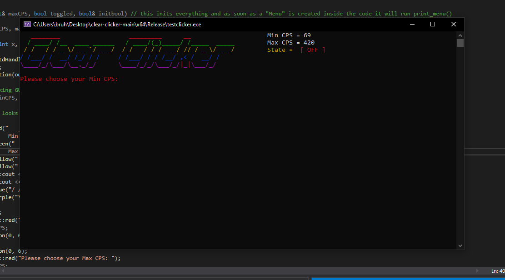

# clear-clicker
A Simple Minecraft AutoClicker made in C++ using the color-console library!
Has support for Range Based Random CPS, Keybind is "F" to activate and deactivate the clicker!

This is only meant for learning purposes and shouldn't be used maliciously.
